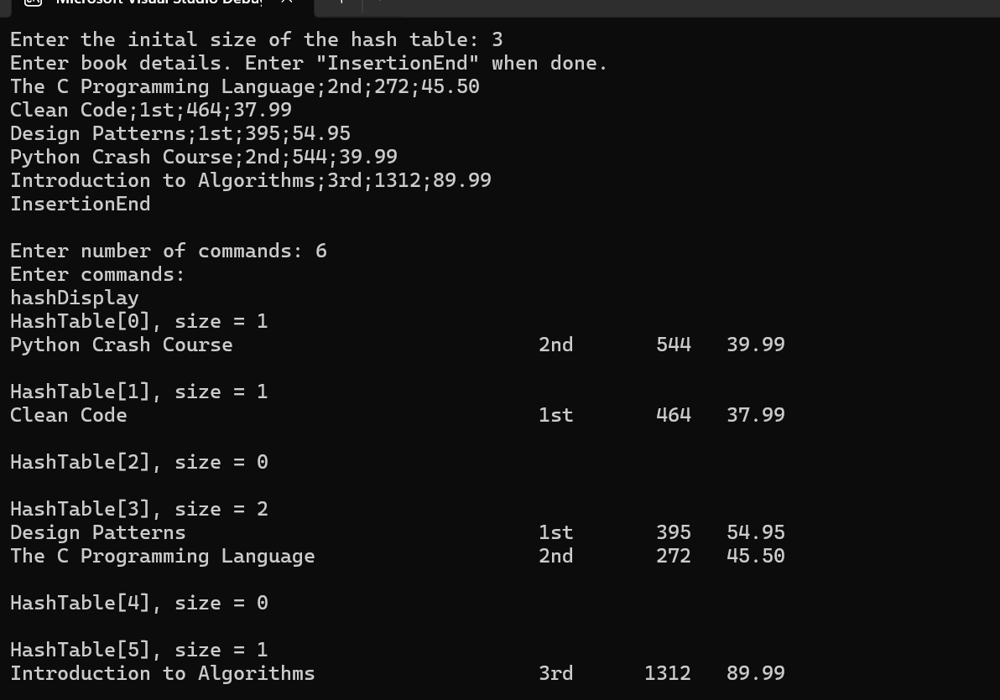
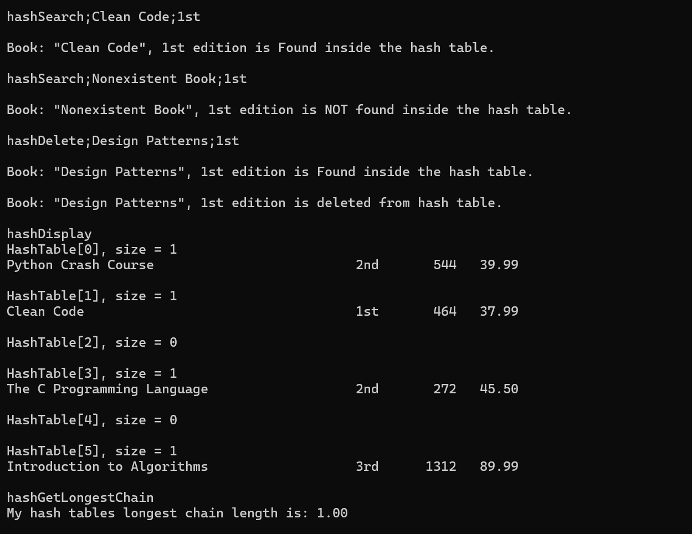

# Hash Table Implementation (C++)

A C++ implementation of a hash table using **separate chaining with linked lists**.  
This project demonstrates core data structures, hashing techniques, and dynamic memory management.

---

## Features

- Hash table with **separate chaining** (linked lists)
- Custom **multiplicative hash function** (golden ratio)
- Supports:
  - Insert
  - Search
  - Delete
  - Display
- Tracks **maximum chain length** (collision behavior)
- Command-driven interface for testing functionality

---

## Performance

- Average case time complexity:
  - Insert: **O(1)**
  - Search: **O(1)**
  - Delete: **O(1)**
- Worst case: **O(n)** when many collisions occur
- Performance is improved by **dynamic resizing and rehashing**

---

## How It Works

Each book is identified by a **key** formed as: 
`title + " " + edition`

The hash table:
1. Computes an index using a custom hash function
2. Stores entries in a linked list at that index
3. Handles collisions using **chaining**
4. Dynamically resizes and rehashes when the load factor increases

---

## Usage 

Example inputs are provided in the `examples/` folder
1. Enter the initial hash table size when prompted
2. Input book entries using the format in `examples/books.txt`
3. Type "InsertionEnd" after finished entering books
4. Enter the number of commands
5. Input commands using the format in `examples/commands.txt`

---

## Example Output

